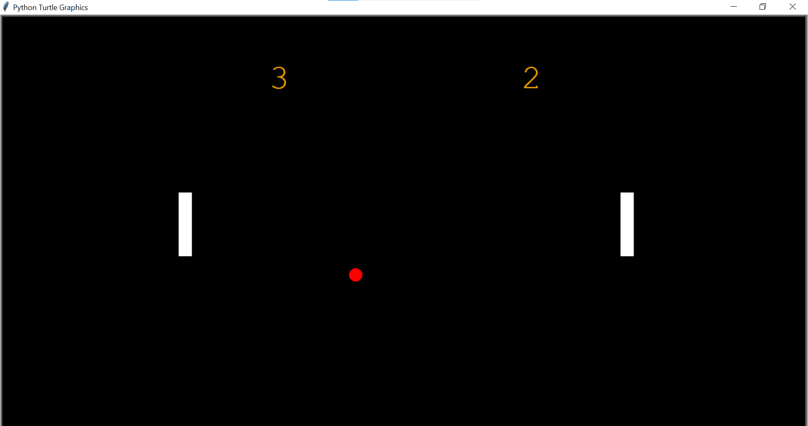

## 🎮 Overview
A classic 2D Ping Pong game developed using Python's Turtle graphics library. This game allows two players to control paddles to hit the ball and prevent it from passing their
side of the screen.

## 📸 Screenshot

## ✨ Features

- Simple and intuitive interface
- Score tracking system
- Smooth paddle controls
-  Dynamic ball speed for increasing challenge

 ## 🕹️ How to Play
 
- Player 1 (Left):
- Move Up: W key
- Move Down: S key
- Player 2 (Right):
- Move Up: Up Arrow key
- Move Down: Down Arrow key
  
## 🤝 Contributing

  Contributions are welcome! Please follow these steps:
  
1-Fork the project
2-Create your feature branch (git checkout -b feature/AmazingFeature)
3-Commit your changes (git commit -m 'Add some AmazingFeature')
4-Push to the branch (git push origin feature/AmazingFeature)
5-Open a Pull Request

## 📜 License

This project is licensed under the MIT License.

## 📧 Contact

  For questions or suggestions, please contact: loubnatech7@gmail.com
